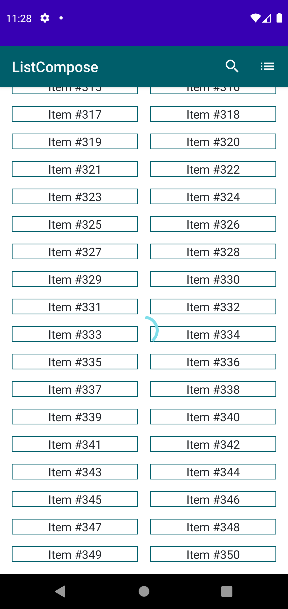

# Ejemplo de listado paginado infinito con Jetpack Compose

En este ejemplo se muestra un listado con formato de grid que va creciendo de forma infinita según se hace scroll vertical.

Por simplicidad no se utiliza inyección de dependencias.

